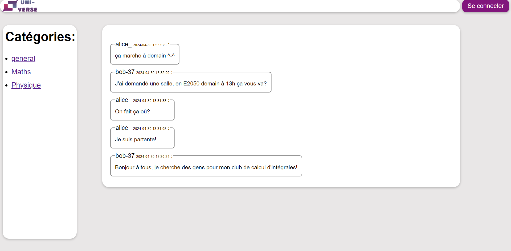
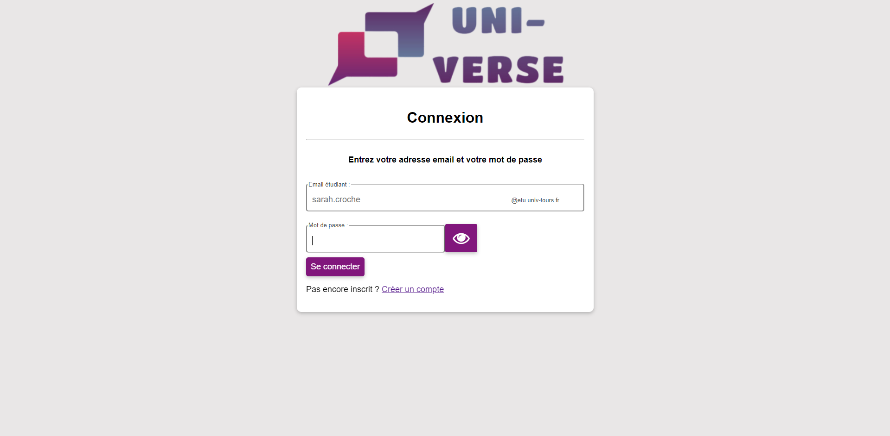
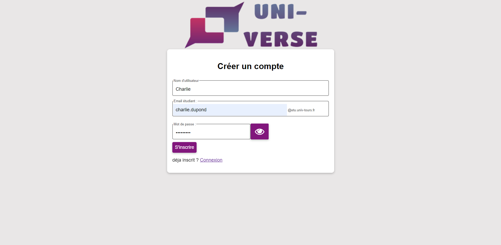
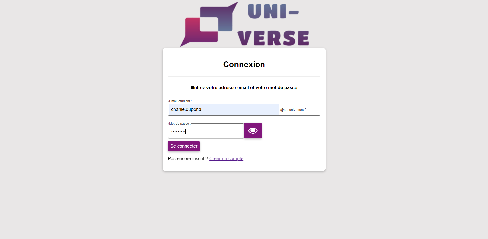
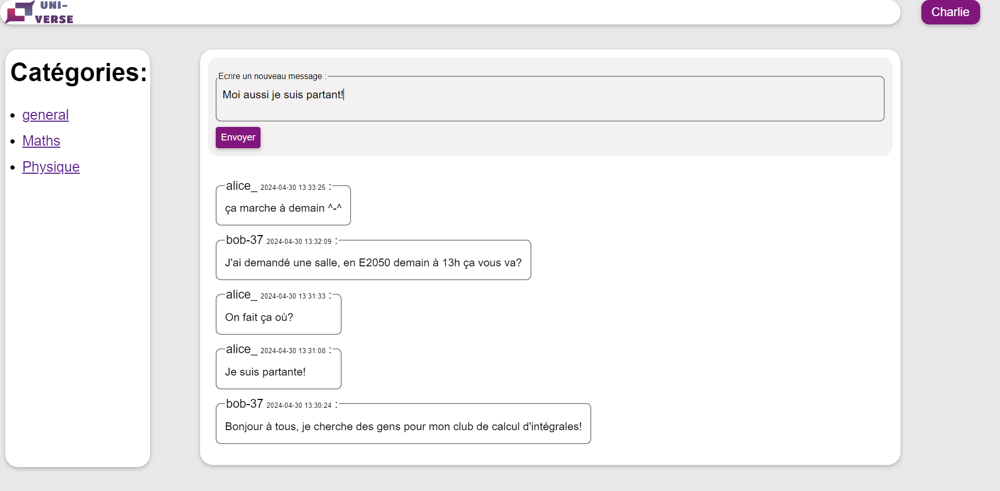

Le site Uni’verse est un espace commun pour tous les étudiants à l'université de Tours qui souhaitent échanger. C’est un forum qui leurs permet de communiquer et qui les relie entre eux, a la différences des autres réseaux sociaux, il permet de vérifier les identités des utilisateurs grace à leur mail étudiant.

En effet le site est constitué d'une page principale, avec différents salons "général","maths","physique"... On voit à gauche les liens pour y accéder.

Tant que l'utilisateur n'est pas connecté, il ne peut pas envoyer de messages. Il doit donc ce connecter avec le bouton en haut à droite.

Si il n'a pas encore de compte il peut s'inscrire, il doit alors renseigner le pseudo qu'il souhaite, son mail étudiant et un mot de passe.

Il recevra alors un mail de confirmation pour son inscription.

Une fois que son compte est validé il peut se connecter:

Et ainsi écrire des messages:

